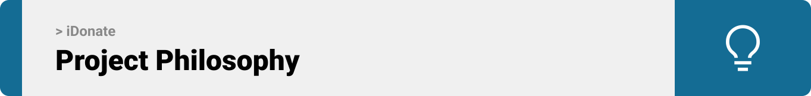
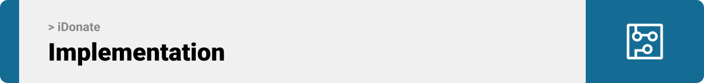

<br><br>

<!-- project philosophy -->


> A mobile app designed to facilitate the donation process of excess food, clothes, and different wastes, aiming to connect donors with those in need through a streamlined platform, enhancing the efficiency of waste distribution and contributing to a more sustainable and compassionate community.

### User Stories
- As a user, I want to browse the menu, so I can find my favorite coffee drinks.
- As a user, I want to customize my order, so I can add or remove ingredients according to my preferences.
- As a user, I want to pay for my order through the app, so I can avoid waiting in line at the store.

<br><br>

<!-- Prototyping -->


> We designed Coffee Express using wireframes and mockups, iterating on the design until we reached the ideal layout for easy navigation and a seamless user experience.

### Wireframes
| Login screen  | Register screen |  Landing screen |
| ---| ---| ---|
|  |  |  |

### Mockups
| Home screen  | Menu Screen | Order Screen |
| ---| ---| ---|
|  |  |  |

<br><br>

<!-- Implementation -->


> Using the wireframes and mockups as a guide, we implemented the Coffee Express app with the following features:

### User Screens (Mobile)
| Login screen  | Register screen | Landing screen | Loading screen |
| ---| ---| ---| ---|
|  |  |  |  |
| Home screen  | Menu Screen | Order Screen | Checkout Screen |
|  |  |  |  |

### Admin Screens (Web)
| Login screen  | Register screen |  Landing screen |
| ---| ---| ---|
|  |  |  |
| Home screen  | Menu Screen | Order Screen |
|  |  |  |

<br><br>

<!-- Tech stack -->


###  iDonate is built using the following technologies:

- This project uses the React Native app development framework. React Native is a cross-platform hybrid app development platform which allows us to use a single codebase for apps on mobile, desktop, and the web.

- For persistent storage (database), the app uses the MySQL package which allows the app to create a custom storage and save it to a local database.

<br><br>

<!-- How to run -->


> To set up Coffee Express locally, follow these steps:

### Prerequisites

This is an example of how to list things you need to use the software and how to install them.
* npm
  ```sh
  npm install npm@latest -g
  ```

### Installation

_Below is an example of how you can instruct your audience on installing and setting up your app. This template doesn't rely on any external dependencies or services._

1. Get a free API Key at [https://example.com](https://example.com)
2. Clone the repo
   ```sh
   git clone https://github.com/your_username_/Project-Name.git
   ```
3. Install NPM packages
   ```sh
   npm install
   ```
4. Enter your API in `config.js`
   ```js
   const API_KEY = 'ENTER YOUR API';
   ```

Now, you should be able to run Coffee Express locally and explore its features.