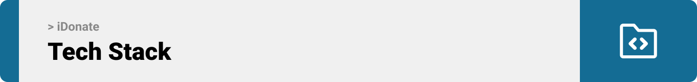
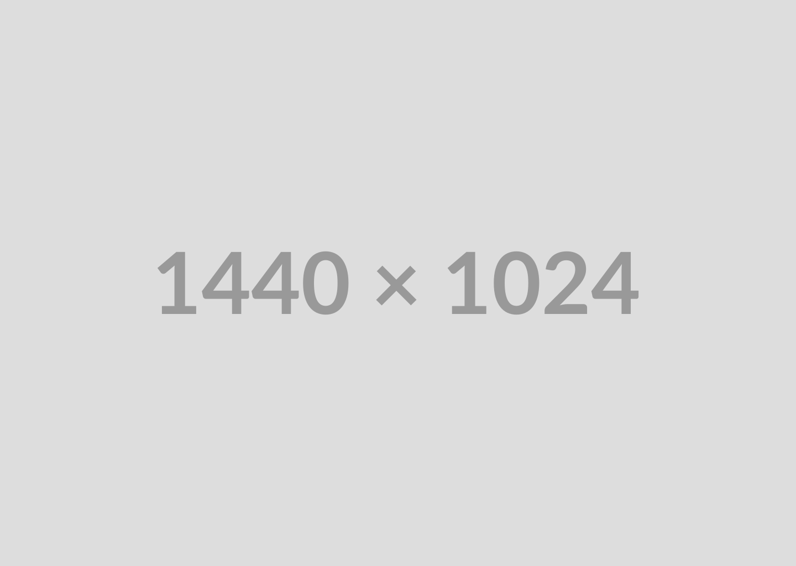
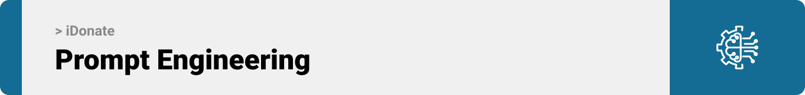
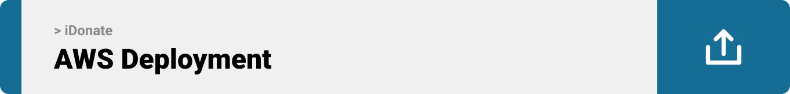

<br><br>

<!-- project philosophy -->


> A mobile app is designed to facilitate the donation process of excess food wastes, connecting donors with delivery drivers, offering features like live tracking for donors. Complemented by a desktop admin panel, the system enhances food waste distribution, fostering a more sustainable and compassionate community.

## User Stories

### Donor:

- As a donor, I want to be able to track the live location of the delivery, so that I can stay updated about whether my order is received and donation completed or not yet.
- As a donor (individual, restaurant, or store), I want to donate excess food easily, so that I can contribute to reducing food waste in my community.
- As a donor, I want to be able to view all my current donation, so that I can easily keep track of my ongoing contributions and stay informed about the status of each donation.
- As a donor, I want to be able to view my completed orders so that I can maintain a detailed record in my order history.

### Delivery:

- As a delivery driver, I want to be able to accept an order, so that I ensure that the donor is promptly informed and the status of the donation order is promptly updated.
- As a delivery driver, I want to scan the QR code of the donor, so that the order status is updated.
- As a delivery driver, I want to be able to view my completed orders so that I can maintain a detailed record in my order history.
- As a delivery driver, I want to be able to view all donation orders, so that I can manage my schedule effectively.

### Admin:

- As an admin, I want to be able to view real-time information about both users, so that I can monitor the system's performance.
- As an admin, I want to be able to approve registered delivery drivers, so that only authorized drivers can provide their services.
- As an admin, I want to be able to delete users, so that I can ensure the smooth functioning of the app's services.

<br><br>

<!-- Prototyping -->


> We designed Coffee Express using wireframes and mockups, iterating on the design until we reached the ideal layout for easy navigation and a seamless user experience.

### Wireframes

| Login screen                               | Register screen                          | Landing screen                           |
| ------------------------------------------ | ---------------------------------------- | ---------------------------------------- |
|  |  |  |

| Login screen                             | Register screen                          | Landing screen                           |
| ---------------------------------------- | ---------------------------------------- | ---------------------------------------- |
|  |  |  |

| Login screen                               | Register screen                          | Landing screen                           |
| ------------------------------------------ | ---------------------------------------- | ---------------------------------------- |
|  |  |  |

| Login screen                                | Register screen                           | Landing screen                            |
| ------------------------------------------- | ----------------------------------------- | ----------------------------------------- |
|  |  |  |

| Login screen                                | Register screen                           | Landing screen                            |
| ------------------------------------------- | ----------------------------------------- | ----------------------------------------- |
|  |  |  |

| Login screen                                | Register screen                           | Landing screen                            | new screen                                |
| ------------------------------------------- | ----------------------------------------- | ----------------------------------------- | ----------------------------------------- |
|  |  |  |  |

### Mockups

| Home screen                             | Menu Screen                           | Order Screen                          |
| --------------------------------------- | ------------------------------------- | ------------------------------------- |
|  |  |  |

<br><br>

<!-- Implementation -->


> Using the wireframes and mockups as a guide, we implemented the Coffee Express app with the following features:

### User Screens (Mobile)

| Login screen                              | Register screen                         | Landing screen                          | Loading screen                          |
| ----------------------------------------- | --------------------------------------- | --------------------------------------- | --------------------------------------- |
|  |  |  |  |
| Home screen                               | Menu Screen                             | Order Screen                            | Checkout Screen                         |
|  |  |  |  |

### Admin Screens (Web)

| Login screen                            | Register screen                       | Landing screen                        |
| --------------------------------------- | ------------------------------------- | ------------------------------------- |
|  |  |  |
| Home screen                             | Menu Screen                           | Order Screen                          |
|  |  |  |

<br><br>

<!-- Tech stack -->


### iDonate is built using the following technologies:

- This project uses the React Native app development framework. React Native is a cross-platform hybrid app development platform which allows us to use a single codebase for apps on mobile, desktop, and the web.

- For persistent storage (database), the app uses the MySQL package which allows the app to create a custom storage and save it to a local database.

<br><br>

<!-- How to run -->

<br><br>

<!-- How to run -->

<br><br>

<!-- How to run -->

<br><br>

<!-- How to run -->

<br><br>

<!-- How to run -->


> To set up Coffee Express locally, follow these steps:

### Prerequisites

This is an example of how to list things you need to use the software and how to install them.

- npm
  ```sh
  npm install npm@latest -g
  ```

### Installation

_Below is an example of how you can instruct your audience on installing and setting up your app. This template doesn't rely on any external dependencies or services._

1. Get a free API Key at [https://example.com](https://example.com)
2. Clone the repo
   ```sh
   git clone https://github.com/your_username_/Project-Name.git
   ```
3. Install NPM packages
   ```sh
   npm install
   ```
4. Enter your API in `config.js`
   ```js
   const API_KEY = "ENTER YOUR API";
   ```

Now, you should be able to run Coffee Express locally and explore its features.
